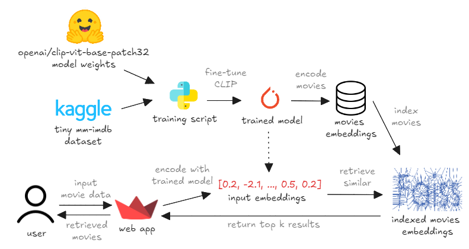
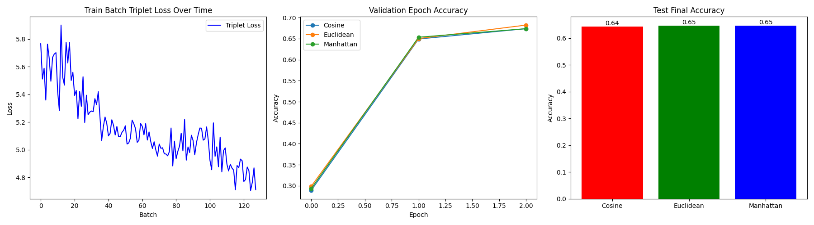
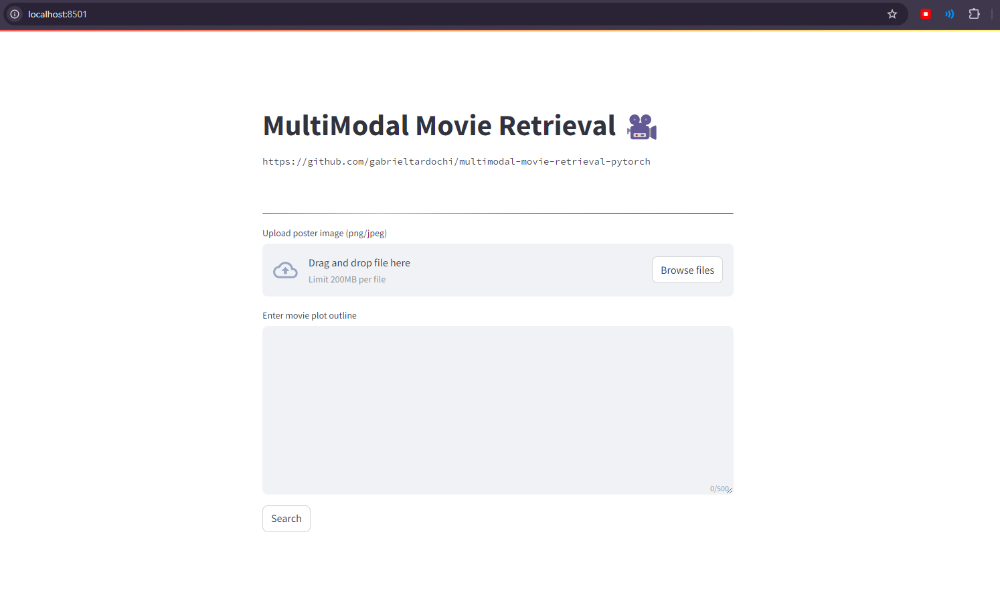
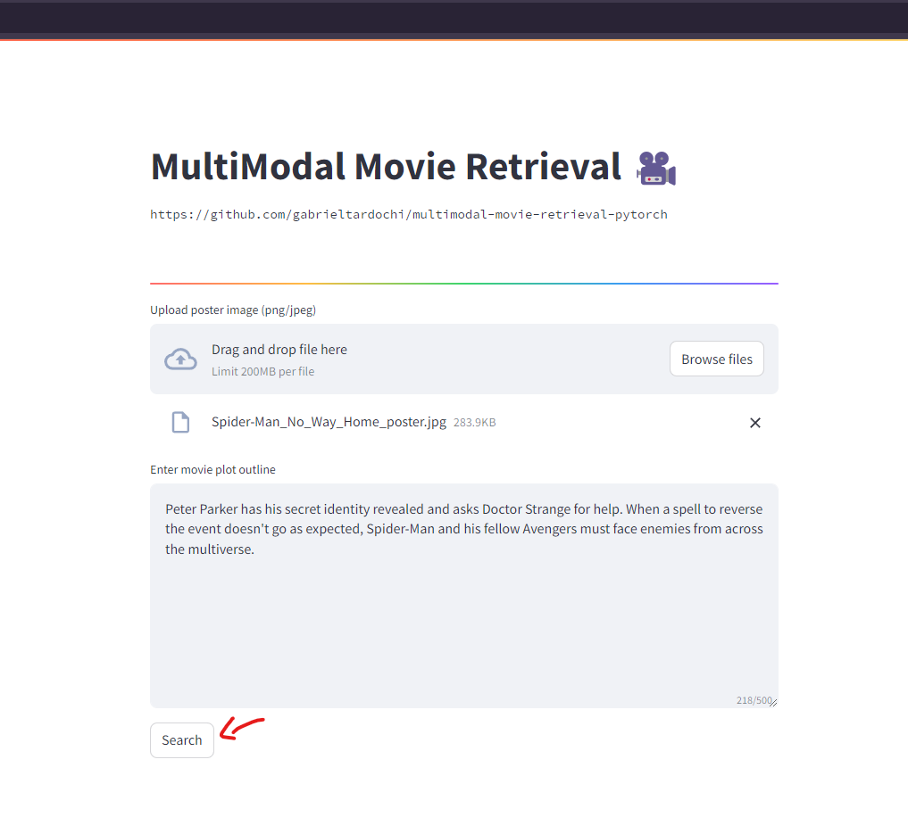
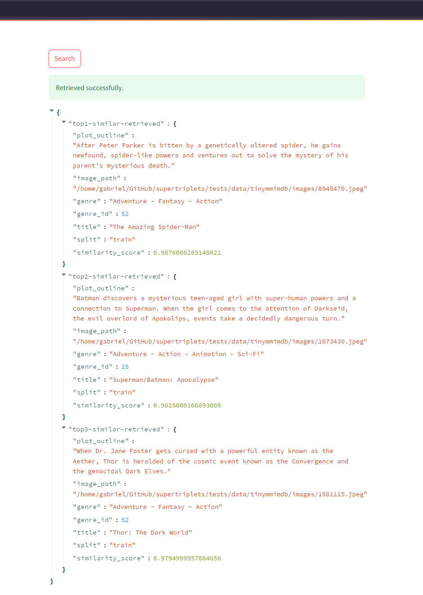

# multimodal-movie-retrieval-pytorch
Basic demo on how to apply `SuperTriplets` to fine-tune CLIP-based embeddings for pairs of movie cover photos and plot outlines to build a multimodal search engine.



The core techs used are `SuperTriplets`, `PyTorch`, `FAISS` and `Streamlit`.

# Development

### Depencies
Make sure you have python3.10+ and python3-venv installed on your machine. Ideally, a GPU available as well.

Start by cloning this repo:
```bash
$ git clone https://github.com/gabrieltardochi/multimodal-movie-retrieval-pytorch.git
```

Now, create a virtual environment:
```bash
$ python3 -m venv .venv
```

Activate this venv:
```bash
$ source .venv/bin/activate
```

Intall dependencies:
```bash
$ pip install -r requirements.txt
```

### Making changes
We are using `pre-commit` to guarantee some level of quality within the codebase.

Whenever you have unstaged/staged changes that you want to commit, run:
```bash
$ python3 -m pre_commit run --files movie_retrieval/* *
```

If `pre-commit` checks passes, you can consider yourself ready to commit your changes.

# Usage
It's easy to train your own model and run movie retrieval locally.

### Acquiring data
First of all, [download](https://www.kaggle.com/datasets/gabrieltardochi/tiny-mm-imdb) and unzip the Tiny MM-IMDb dataset from Kaggle.

Now, create a `.env` file (if not exists) following the example provided in `.env.example`. Make sure the var `TINY_MMIMDB_DATASET_PATH` is defined. Here's how the `.venv` should be looking like so far:
```bash
TINY_MMIMDB_DATASET_PATH=<SAVED DATASET PATH HERE>  # e.g. /home/gabriel/datasets/tinymmimdb
```

### Finetuning CLIP-based MultiModal encoder
It's really simple to run training. You can inspect the `movie_retrieval.train` module to understand how It works. 

The expected parameters (grabbed by running `python -m movie_retrieval.train --help`) are:
```console
Training configuration parser

options:
  -h, --help            show this help message and exit
  --in_batch_num_samples_per_label IN_BATCH_NUM_SAMPLES_PER_LABEL
                        Number of samples per label in a batch (default: 2)
  --batch_size BATCH_SIZE
                        Size of each batch (default: 32)
  --learning_rate LEARNING_RATE
                        Learning rate for training (default: 2e-5)
  --num_epochs NUM_EPOCHS
                        Number of epochs for training (default: 2)
```

Change default parameters if desired and start finetuning:
```bash
$ python -m movie_retrieval.train
```

After training, you should be able to find a new folder inside the `artifacts/` folder with your trained model weights, parameters, metrics and plots. The tree should look something like this:
```console
artifacts
└── 2024-09-16-10-09-07-877894
    ├── model_state_dict.pt
    ├── training-config.json
    ├── training-stats.json
    └── training-stats.png
```

Inspect those files to better understand your training run. Example of performance metrics found at `training-stats.png`:



### Encoding movies and indexing them into a FAISS index

When you are happy with training and have finetuned a reasonable movie encoder, add the var `TRAINED_MODEL_STATE_DICT_PATH` to your  `.env` file and point to your model weights:
```bash
TRAINED_MODEL_STATE_DICT_PATH=<PT MODEL WEIGHTS PATH> # e.g. artifacts/2024-09-16-10-09-07-877894/model_state_dict.pt
```

With that out of the way, simply run the following to create your movie FAISS index `movie-retrieval.index`:
```bash
$ python -m movie_retrieval.index
```

### Retrieving similar movies on demand with Streamlit

We are now ready to create a web app to test our model embeddings interactively. This is extremely easy with Streamlit:
```bash
$ streamlit run app.py
```

You can open http://localhost:8501 locally to interact with your retrieval system:


Enter a movie's cover image and plot outline to search for similar indexed movies. Here I'll be using "Spider-Man: No Way Home" (2021):

*Cover image*


*Plot outline*

"Peter Parker has his secret identity revealed and asks Doctor Strange for help. When a spell to reverse the event doesn't go as expected, Spider-Man and his fellow Avengers must face enemies from across the multiverse." 

Input this data and click "Search" to retrieve similar movies:



Looking good! We can actually find similar movies (same genre, and other Spider-Man movies) that we have indexed successfully:


